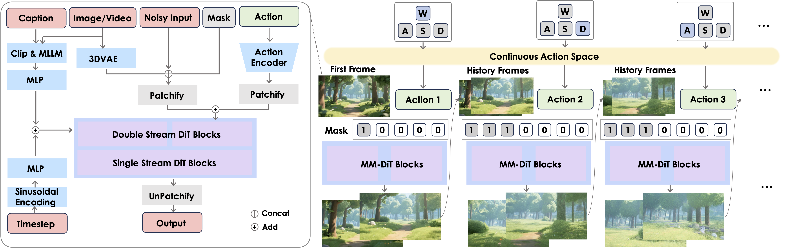
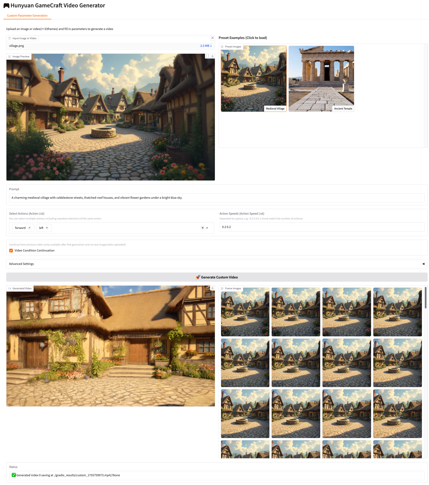

<!-- ## **Hunyuan-GameCraft** -->

<!-- <p align="center">
  
</p> -->

# **Hunyuan-GameCraft** 🎮
 
<div align="center">
  <a href="https://github.com/Tencent-Hunyuan/Hunyuan-GameCraft-1.0"></a> &ensp;
  <a href="https://hunyuan-gamecraft.github.io/"></a> &ensp;
<a href="https://arxiv.org/abs/2506.17201"></a> &ensp;
  <a href="https://huggingface.co/tencent/Hunyuan-GameCraft-1.0"></a> &ensp;
</div>


> [**Hunyuan-GameCraft: High-dynamic Interactive Game Video Generation with Hybrid History Condition**](https://arxiv.org/abs/2506.17201) <be>


## 🔥🔥🔥 News!!
* Aug  21, 2025: 📣 We release the code of the [Gradio demo](scripts/launch_app_sp.sh). Welcome and have a try!! 🎮
* Aug  14, 2025: 👋 We release the inference code and model weights of Hunyuan-GameCraft. [Download](weights/README.md).


## 📑 Open-source Plan

- Hunyuan-GameCraft
  - [x] Inference 
  - [x] Checkpoints
  - [x] [Gradio](#️-gradio-launching)
  - [ ] HuggingFace Demo

## Contents
- [**Hunyuan-GameCraft** 🎮](#hunyuan-gamecraft-)
  - [🔥🔥🔥 News!!](#-news)
  - [📑 Open-source Plan](#-open-source-plan)
  - [Contents](#contents)
  - [**Abstract**](#abstract)
  - [**Overall Architecture**](#overall-architecture)
  - [📜 Requirements](#-requirements)
  - [🛠️ Dependencies and Installation](#️-dependencies-and-installation)
    - [Installation Guide for Linux](#installation-guide-for-linux)
  - [🧱 Download Pretrained Models](#-download-pretrained-models)
  - [🚀 Parallel Inference on Multiple GPUs](#-parallel-inference-on-multiple-gpus)
  - [🔑 Single-gpu with Low-VRAM Inference](#-single-gpu-with-low-vram-inference)
  - [🖥️ Gradio Launching](#️-gradio-launching)
  - [🔗 BibTeX](#-bibtex)
  - [Acknowledgements](#acknowledgements)
---

## **Abstract**

Recent advances in diffusion-based and controllable video generation have enabled high-quality and temporally coherent video synthesis, laying the groundwork for immersive interactive gaming experiences. However, current methods face limitations in **dynamics**, **physically realistic**, **long-term consistency**, and **efficiency**, which limit the ability to create various gameplay videos. To address these gaps, we introduce Hunyuan-GameCraft, a novel framework for high-dynamic interactive video generation in game environments. To achieve fine-grained action control, we unify standard keyboard and mouse inputs into a **shared camera representation space**, facilitating smooth interpolation between various camera and movement operations. Then we propose a **hybrid history-conditioned training strategy** that extends video sequences autoregressively while preserving game scene information. Additionally, to enhance inference efficiency and playability, we achieve **model distillation** to reduce computational overhead while maintaining consistency across long temporal sequences, making it suitable for real-time deployment in complex interactive environments. The model is trained on a large-scale dataset comprising over one million gameplay recordings across over 100 AAA games, ensuring broad coverage and diversity, then fine-tuned on a carefully annotated synthetic dataset to enhance precision and control. The curated game scene data significantly improves the visual fidelity, realism and action controllability. Extensive experiments demonstrate that Hunyuan-GameCraft significantly outperforms existing models, advancing the realism and playability of interactive game video generation.

## **Overall Architecture**



Given a reference image and the corresponding prompt, the keyboard or mouse signal, we transform these options to the continuous camera space. Then we design a light-weight action encoder to encode the input camera trajectory. The action and image features are added after patchify. For long video extension, we design a variable mask indicator, where 1 and 0 indicate history frames and predicted frames, respectively.


## 📜 Requirements

* An NVIDIA GPU with CUDA support is required. 
  * The model is tested on a machine with 8*H20/H800GPUs.
  * **Minimum**: The minimum GPU memory required is 24GB but very slow.
  * **Recommended**: We recommend using a GPU with 80GB of memory for better generation quality.
* Tested operating system: Linux


## 🛠️ Dependencies and Installation

Begin by cloning the repository:
```shell
git clone https://github.com/Tencent-Hunyuan/Hunyuan-GameCraft-1.0.git
cd Hunyuan-GameCraft-1.0
```

### Installation Guide for Linux

We recommend CUDA versions 12.4 for the manual installation.

Conda's installation instructions are available [here](https://docs.anaconda.com/free/miniconda/index.html).

```shell
# 1. Create conda environment
conda create -n HYGameCraft python==3.10

# 2. Activate the environment
conda activate HYGameCraft

# 3. Install PyTorch and other dependencies using conda
conda install pytorch==2.5.1 torchvision==0.20.0 torchaudio==2.5.1 pytorch-cuda=12.4 -c pytorch -c nvidia

# 4. Install pip dependencies
python -m pip install -r requirements.txt
# 5. Install flash attention v2 for acceleration (requires CUDA 11.8 or above)
python -m pip install ninja
python -m pip install git+https://github.com/Dao-AILab/flash-attention.git@v2.6.3
```

Additionally, you can also use HunyuanVideo Docker image. Use the following command to pull and run the docker image.

```shell
# For CUDA 12.4 (updated to avoid float point exception)
docker pull hunyuanvideo/hunyuanvideo:cuda_12
docker run -itd --gpus all --init --net=host --uts=host --ipc=host --name hunyuanvideo --security-opt=seccomp=unconfined --ulimit=stack=67108864 --ulimit=memlock=-1 --privileged hunyuanvideo/hunyuanvideo:cuda_12
pip install diffusers==0.34.0 transformers==4.54.1

```


## 🧱 Download Pretrained Models

The details of download pretrained models are shown [here](weights/README.md).

## 🚀 Parallel Inference on Multiple GPUs

For example, to generate a video using 8 GPUs, you can use the following command, where `--action-list w s d a` simulate keyboard manipulation signals to help you generate a video of the corresponding content. `--action-speed-list 0.2 0.2 0.2 0.2` represents the displacement distance and can be replaced with any value between 0 and 3. 

You can try any combination and any length of the action list (one action per 33 frames, 25FPS) to generate a long video, and make sure the length of `--action-speed-list` must be the same as `--action-list`. It should be noticed that the inference time is linearly related to the action length:

```bash
#!/bin/bash
JOBS_DIR=$(dirname $(dirname "$0"))
export PYTHONPATH=${JOBS_DIR}:$PYTHONPATH
export MODEL_BASE="weights/stdmodels"
checkpoint_path="weights/gamecraft_models/mp_rank_00_model_states.pt"

current_time=$(date "+%Y.%m.%d-%H.%M.%S")
modelname='Tencent_hunyuanGameCraft_720P'

torchrun --nnodes=1 --nproc_per_node=8 --master_port 29605 hymm_sp/sample_batch.py \
    --image-path "asset/village.png" \
    --prompt "A charming medieval village with cobblestone streets, thatched-roof houses, and vibrant flower gardens under a bright blue sky." \
    --add-pos-prompt "Realistic, High-quality." \
    --add-neg-prompt "overexposed, low quality, deformation, a poor composition, bad hands, bad teeth, bad eyes, bad limbs, distortion, blurring, text, subtitles, static, picture, black border." \
    --ckpt ${checkpoint_path} \
    --video-size 704 1216 \
    --cfg-scale 2.0 \
    --image-start \
    --action-list w s d a \
    --action-speed-list 0.2 0.2 0.2 0.2 \
    --seed 250160 \
    --infer-steps 50 \
    --flow-shift-eval-video 5.0 \
    --save-path './results/'

```


Additionally, we support FP8 optimization and [SageAttn](https://github.com/thu-ml/SageAttention). To enable FP8, simply add the `--use-fp8` to your command. 
And install SageAttention with:
```bash
git clone https://github.com/thu-ml/SageAttention.git
cd SageAttention 
python setup.py install  # or pip install -e .
```

We also provide an accelerated model, you can use the following command:
```bash
#!/bin/bash
JOBS_DIR=$(dirname $(dirname "$0"))
export PYTHONPATH=${JOBS_DIR}:$PYTHONPATH
export MODEL_BASE="weights/stdmodels"
checkpoint_path="weights/gamecraft_models/mp_rank_00_model_states_distill.pt"

current_time=$(date "+%Y.%m.%d-%H.%M.%S")
modelname='Tencent_hunyuanGameCraft_720P'

torchrun --nnodes=1 --nproc_per_node=8 --master_port 29605 hymm_sp/sample_batch.py \
    --image-path "asset/village.png" \
    --prompt "A charming medieval village with cobblestone streets, thatched-roof houses, and vibrant flower gardens under a bright blue sky." \
    --add-neg-prompt "overexposed, low quality, deformation, a poor composition, bad hands, bad teeth, bad eyes, bad limbs, distortion, blurring, text, subtitles, static, picture, black border." \
    --ckpt ${checkpoint_path} \
    --video-size 704 1216 \
    --cfg-scale 1.0 \
    --image-start \
    --action-list w s d a \
    --action-speed-list 0.2 0.2 0.2 0.2 \
    --seed 250160 \
    --infer-steps 8 \
    --use-fp8 \
    --flow-shift-eval-video 5.0 \
    --save-path './results_distill/'
```


## 🔑 Single-gpu with Low-VRAM Inference

For example, to generate a video with 1 GPU with Low-VRAM (minimum GPU memory required is 24GB for 704px1216p but very slow), you can use the following command:

```bash
#!/bin/bash
JOBS_DIR=$(dirname $(dirname "$0"))
export PYTHONPATH=${JOBS_DIR}:$PYTHONPATH
export MODEL_BASE="weights/stdmodels"
checkpoint_path="weights/gamecraft_models/mp_rank_00_model_states.pt"

current_time=$(date "+%Y.%m.%d-%H.%M.%S")
modelname='Tencent_hunyuanGameCraft_720P'

# disable sp and cpu offload
export DISABLE_SP=1
export CPU_OFFLOAD=1

torchrun --nnodes=1 --nproc_per_node=1 --master_port 29605 hymm_sp/sample_batch.py \
    --image-path "asset/village.png" \
    --prompt "A charming medieval village with cobblestone streets, thatched-roof houses, and vibrant flower gardens under a bright blue sky." \
    --add-neg-prompt "overexposed, low quality, deformation, a poor composition, bad hands, bad teeth, bad eyes, bad limbs, distortion, blurring, text, subtitles, static, picture, black border." \
    --ckpt ${checkpoint_path} \
    --video-size 704 1216 \
    --cfg-scale 2.0 \
    --image-start \
    --action-list w a d s \
    --action-speed-list 0.2 0.2 0.2 0.2 \
    --seed 250160 \
    --sample-n-frames 33 \
    --infer-steps 50 \
    --flow-shift-eval-video 5.0 \
    --cpu-offload \
    --use-fp8 \
    --save-path './results_poor/'

```

As for using the accelerated model, you can use the following command:

```bash
#!/bin/bash
JOBS_DIR=$(dirname $(dirname "$0"))
export PYTHONPATH=${JOBS_DIR}:$PYTHONPATH
export MODEL_BASE="weights/stdmodels"
checkpoint_path="weights/gamecraft_models/mp_rank_00_model_states_distill.pt"

current_time=$(date "+%Y.%m.%d-%H.%M.%S")
modelname='Tencent_hunyuanGameCraft_720P'

# disable sp and cpu offload
export DISABLE_SP=1
export CPU_OFFLOAD=1

torchrun --nnodes=1 --nproc_per_node=1 --master_port 29605 hymm_sp/sample_batch.py \
    --image-path "asset/village.png" \
    --prompt "A charming medieval village with cobblestone streets, thatched-roof houses, and vibrant flower gardens under a bright blue sky." \
    --add-neg-prompt "overexposed, low quality, deformation, a poor composition, bad hands, bad teeth, bad eyes, bad limbs, distortion, blurring, text, subtitles, static, picture, black border." \
    --ckpt ${checkpoint_path} \
    --video-size 704 1216 \
    --cfg-scale 1.0 \
    --image-start \
    --action-list w a d s \
    --action-speed-list 0.2 0.2 0.2 0.2 \
    --seed 250160 \
    --sample-n-frames 33 \
    --infer-steps 8 \
    --flow-shift-eval-video 5.0 \
    --cpu-offload \
    --use-fp8 \
    --save-path './results_distill_poor/'
```

## 🖥️ Gradio Launching
Refer to the corresponding comments to modify the following sections in `scripts/launch_app_sp.sh`:
``` bash
export MODEL_BASE="weights/stdmodels"
export CKPT_PATH="weights/gamecraft_models/mp_rank_00_model_states.pt"
export API_PORT="8082" # For distributed inference server port
export GRADIO_PORT="8080" # For GradioUI port
export VIDEO_ENC="vp09" # "avc1"(faster)
NUM_GPUS=8
```
After installing gradio(>5.0) and flask, simply run:
``` bash
bash scripts/launch_app_sp.sh
```
This will automatically start the distributed inference API service and the Gradio web interface (default: http://127.0.0.1:8080). All runtime logs are available in `gradio_results/api.log`(API service logs) and `gradio_results/worker.log`(inference worker logs). The web interface looks like:



## 🔗 BibTeX

If you find [Hunyuan-GameCraft](https://arxiv.org/abs/2506.17201) useful for your research and applications, please cite using this BibTeX:

```BibTeX
@misc{li2025hunyuangamecrafthighdynamicinteractivegame,
    title={Hunyuan-GameCraft: High-dynamic Interactive Game Video Generation with Hybrid History Condition}, 
    author={Jiaqi Li and Junshu Tang and Zhiyong Xu and Longhuang Wu and Yuan Zhou and Shuai Shao and Tianbao Yu and Zhiguo Cao and Qinglin Lu},
    year={2025},
    eprint={2506.17201},
    archivePrefix={arXiv},
    primaryClass={cs.CV},
    url={https://arxiv.org/abs/2506.17201}, 
}
```

## Acknowledgements

We would like to thank the contributors to the [HunyuanVideo](https://github.com/Tencent/HunyuanVideo), [HunyuanVideo-Avatar](https://github.com/Tencent-Hunyuan/HunyuanVideo-Avatar),[SD3](https://huggingface.co/stabilityai/stable-diffusion-3-medium), [FLUX](https://github.com/black-forest-labs/flux), [Llama](https://github.com/meta-llama/llama), [LLaVA](https://github.com/haotian-liu/LLaVA), [Xtuner](https://github.com/InternLM/xtuner), [diffusers](https://github.com/huggingface/diffusers) and [HuggingFace](https://huggingface.co) repositories, for their open research and exploration. 
